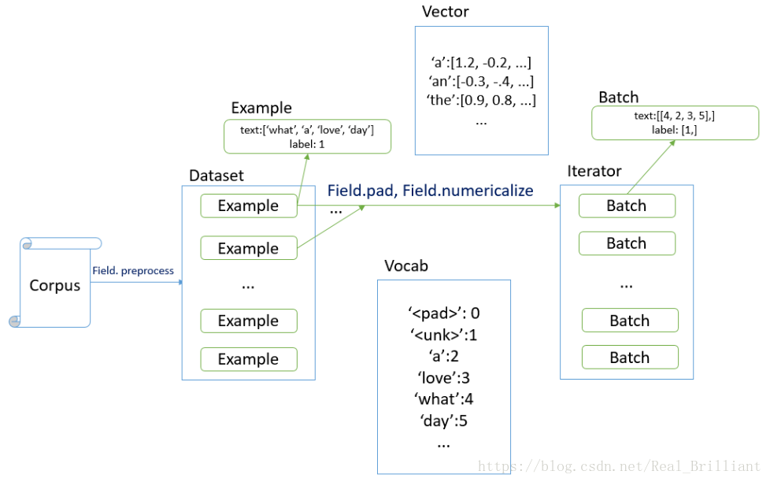
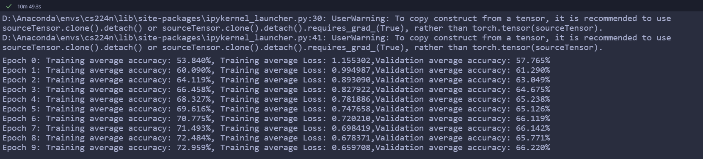
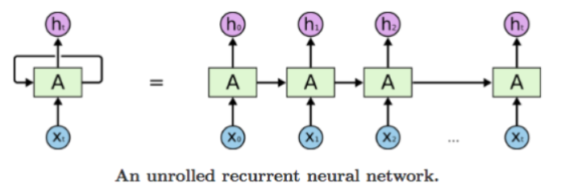
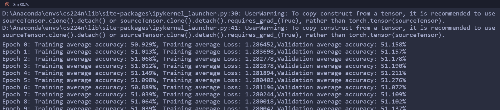
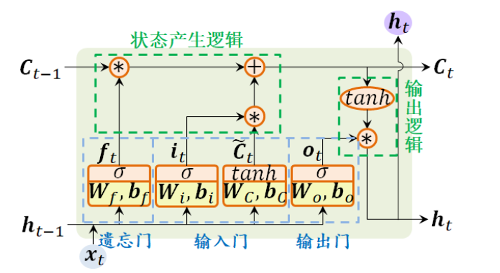
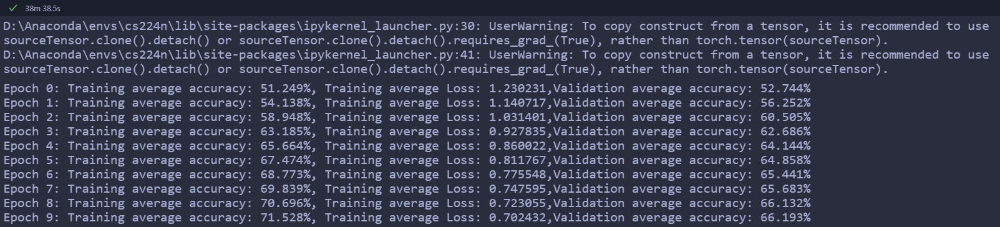

# 任务二：基于深度学习的文本分类

**熟悉Pytorch，用Pytorch重写《任务二》，实现CNN、RNN的文本分类**

> 参考项目：[nlp-beginner-projects/project2-DL-Sentence Classification at master · positivepeng/nlp-beginner-projects (github.com)](https://github.com/positivepeng/nlp-beginner-projects/tree/master/project2-DL-Sentence Classification)

## 要求

1. 参考

   1. https://pytorch.org/
   2. Convolutional Neural Networks for Sentence Classification <https://arxiv.org/abs/1408.5882>
   3. <https://machinelearningmastery.com/sequence-classification-lstm-recurrent-neural-networks-python-keras/>
2. word embedding的方式初始化
3. 随机embedding的初始化方式
  4. 用glove 预训练的embedding进行初始化 https://nlp.stanford.edu/projects/glove/
5. 知识点：

   1. CNN/RNN的特征抽取
   2. 词嵌入
   3. Dropout
6. 时间：两周

## 词嵌入embedding

词嵌入（Word Embedding 是将自然语言表示的单词转换为计算机能够理解的向量或矩阵形式的技术。`task 1 ` 已经采用 ==Bag-of-Word==、==n-gram== 的方法。本task尝试采用开源库 `torchtext` 完成预处理部分。`torchtext`对数据的处理可以概括为`Field`，`Dataset`和迭代器这三部分。

[Torchtext使用教程 - 简书 (jianshu.com)](https://www.jianshu.com/p/71176275fdc5)

### 处理单词 | Field

Field对象指定要如何处理某个字段，将单词映射为向量，这样的映射称为 `vocab`，若是label字段，本身已经数字化，则无需再序列化。

- **重要参数**

```python
Field.sequential – 输入的数据是否是序列型的，如果不是，将不使用tokenzie对数据进行处理。文本数据一般设置为True
Field.use_vocab – 是否使用Vocab对象，也就是使用输入的词向量，这里以后会讲到，如果不使用，那么输入Field的对象一定是数字类型的。
Field.tokenize – 设置一个tokenize分词器给Field用，这里也有内置的一些分词器可以用
```

- **代码**

  先定义分词操作，再规定处理格式。

```python
spacy_en = spacy.load('en_core_web_sm')

def tokenizer(text): # create a tokenizer function
    """
    定义分词操作
    """
    return [tok.text for tok in spacy_en.tokenizer(text)]

TEXT = data.Field(sequential = True, tokenize = tokenizer, lower = True)
LABEL = data.Field(sequential = False, use_vocab = False)
```

### 构建词表 | build_vocab

所谓构建词表，即需要给每个单词编码，也就是用数字来表示每个单词，这样才能够传入模型中。

- **使用预训练的词向量**

`bulid_vocab()` 方法中传入用于构建词表的数据集，在使用pytorch或tensorflow等神经网络框架进行nlp任务的处理时，可以通过对应的Embedding层做词向量的处理，更多的时候，使用**预训练好的词向量**会带来更优的性能。

- **方式1：使用torchtext默认支持的预训练词向量**

默认情况下，会自动下载对应的预训练词向量文件到当前文件夹下的`.vector_cache` 目录下，`.vector_cache` 为默认的词向量文件和缓存文件的目录，这里使用glove 预训练的embedding进行初始化。

```python
TEXT.build_vocab(train, vectors=GloVe(name='6B', dim=300))
# 在这种情况下，会默认下载glove.6B.zip文件，进而解压出glove.6B.50d.txt, glove.6B.100d.txt, glove.6B.200d.txt, glove.6B.300d.txt这四个文件，因此我们可以事先将glove.6B.zip或glove.6B.200d.txt放在.vector_cache文件夹下(若不存在，则手动创建)。
# 使用训练集构建单词表
TEXT.build_vocab(train, vectors='glove.6B.50d')
```

> 自动下载很慢，最好手动先下载。
>
> [(52条消息) 最新GLove词向量预训练文件国内服务器下载_Troublemaker丶的博客-CSDN博客_glove词向量下载](https://blog.csdn.net/weixin_44912159/article/details/105538891)

- **方式2：使用外部预训练好的词向量**

使用`torchtext.vocab.Vectors`中的 `name` 和 `cache` 参数指定预训练的词向量文件和缓存文件的所在目录。因此我们也可以使用自己用word2vec等工具训练出的词向量文件，只需将词向量文件放在name指定的目录中即可。

默认情况下预训练词向量文件和缓存文件的目录位置都为当前目录下的 `.vector_cache` 目录。

```python
# glove.6B.200d.txt为预先下载好的预训练词向量文件
if not os.path.exists(.vector_cache):
    os.mkdir(.vector_cache)
vectors = Vectors(name='myvector/glove/glove.6B.200d.txt')
TEXT.build_vocab(train, vectors=vectors)
```

### 读取文件 | Tabulardataset.splits

同时读取训练集、验证集与测试集，`path`为路径，`train`、`validation`和`test`为文件名。不同的字段赋值为不同的`field`。

```python
 train, val = data.TabularDataset.splits(
        path='', train=train_df_path, validation=val_df_path, format='csv', skip_header=True,
        fields=[("Phrase", TEXT), ("Sentiment", LABEL)])
```

### 迭代器 | BucketIterator

定义一个迭代器，用于将相似长度的示例批处理在一起。最大限度地减少每次迭代所有 `batch` 所需的填充量 `<pad>`，提高计算效率。

[[torchtext\]如何利用torchtext读取json文件并生成batch - 代码天地 (codetd.com)](https://www.codetd.com/article/4655075)

```python
train_iter = data.Iterator(dataset=train, batch_size=256, shuffle=True,  sort_within_batch=False, repeat=False, device=configs.device)
val_iter = data.Iterator(dataset=val, batch_size=256, shuffle=False,  sort=False, repeat=False, device=configs.device)
test_iter = data.Iterator(dataset=test, batch_size=256, shuffle=False, sort=False, repeat=False, device=configs.device)
```

| 属性          | 含义                       |
| ------------- | -------------------------- |
| dataset       | 加载的数据集               |
| batch_size    | Batch 大小                 |
| batch_size_fn | 产生动态的batch_size的函数 |
| sort_key      | 排序的key                  |
| train         | 是否为训练集               |
| repeat        | 是否在不同epoch中重复迭代  |
| shuffle       | 是否打乱数据               |
| sort          | 是否对数据进行排序         |

### 整体流程总结



## pytorch定义深度网络层

- `class`模版

  `__init__`中定义卷积层、池化层、全连接层等等，`forward` 中定义前向传播计算的结果。

- 定义损失函数，优化器
- 设置迭代次数，进行迭代
  - 前向传播
  - 计算损失值
  - 反向传播
    - `zero_grad()`优化器梯度清0
    - `backward()`自动微分求梯度
    - `step()` 更新参数

```python
from torch import nn
import torch.nn.functional as F
class net_name(nn.Module):
    def __init__(self):
        super(net_name, self).__init__()
        # 可以添加各种网络层，in_channels=3, out_channels=10, kernel_size=3
        self.conv1 = nn.Conv2d(3, 10, 3)
        # 激活函数
        self.act = nn.ReLU()
    def forward(self, x):
        # 定义向前传播
        out = self.conv1(x)
        return out

model = Model_name()  # 模型实例化
loss_func = torch.nn.MSELoss()  # 定义损失函数
optimizer = torch.optim.SGD(model.parameters(), lr=0.1)  # 定义优化器

num_iter = 100  # 定义最大迭代轮数
for step in range(num_iter):
    # forward
    prediction = model(x_train)            # 前向传播
    loss = loss_func(prediction, y_train)  # 计算损失函数值

    # 反向传播backward
    optimizer.zero_grad()  # 每次做反向传播前都要将梯度清零，否则梯度会一直累加
    loss.backward()        # 自动微分求梯度
    optimizer.step()       # 梯度反向传播，更新参数
```

## TextCNN

### 卷积层

- 定义

```python
torch.nn.Conv2d(in_channels, out_channels, kernel_size, stride=1, padding=0, dilation=1, groups=1, bias=True, padding_mode='zeros', device=None, dtype=None)
```

- 参数解释

| 参数                     | 含义               |
| ------------------------ | ------------------ |
| in_channels （int）      | 输入图像中的通道数 |
| out_channels （int）     | 卷积产生的通道数   |
| kernel_size（int/tuple） | 卷积核的大小       |
| stride                   | 卷积的步幅         |
| padding                  | 填充               |

- 矩阵运算时维度变换
  1. 输入x的维度为(Batchsize, Length) 
  2. 进行映射，embedding层输出维度 (batch_size, seq_len, embedding_size)
  3. 增加维度(Batch_size, 1, Length, Dimention) ，变为四维张量
  4. 卷积层，(Batch_size, filter_num, length+padding, 1) 
  5. 降低维度(Batch_size, filter_num, length+padding) 
  6. 最大池化(Batch_size, filters_num,1) 
  7. 降低维度(Batch_size, filters_num) 
- 三层卷积层结果在行进行拼接

```python
# (Batch_size, filters_num *3 )
out_cat = torch.cat((pool1_out,pool2_out,pool3_out), dim = 1)
```

### 全连接层

输出维度为`(Batch_size, class_num)`

```python
# 全连接层
self.fc = nn.Linear(3 * filter_num, class_num)
out_cat = self.dropout(out_cat)
 # (Batch_size, class_num)
out = self.fc(out_cat)
```

### 结果

训练效果好，耗时也不是很长。



## TextRNN

### 原理

通过使用带自反馈的神经元， 能够处理任意长度的时序数据 。可以看做是同一神经网络的多次赋值，每个神经网络模块会把消息传递给下一个。



### nn.RNN

主要是nn.RNN模块的使用

- **定义**

```python
nn.RNN(input_size, hidden_size, num_layers=1, nonlinearity=tanh, bias=True, batch_first=False, dropout=0, bidirectional=False)
```

- **参数解释**

input_size：输入特征的维度， 一般rnn中输入的是词向量，那么 input_size 就等于一个词向量的维度

hidden_size：隐藏层神经元个数，或者也叫输出的维度（因为rnn输出为各个时间步上的隐藏状态）

num_layers：网络的层数

nonlinearity：激活函数

bias：是否使用偏置

batch_first：输入数据的形式，默认是 False，为形式(seq(num_step), batch, input_dim)，也就是将序列长度放在第一位。本任务实现是batch 放在第一位，因此为 True。

dropout是否应用dropout, 默认不使用，如若使用将其设置成一个0-1的数字即可

birdirectional是否使用双向的 rnn，默认是 False

- **使用时的输入**
  1. 外部输入 x，当`batch_first=True`时维度为 (batch_size, seq_len, embedding_dim)
  2. 上一时刻输出 h_0 (num_layers \* num_directions, batch, hidden_size)

### 结果

也不知道是不是哪里写错了，这个普通的RNN的结果一整个就是处于没怎么训练的状态，当然，也有可能是我设置的迭代次数太少了...



## LSTM

长短期记忆网络（ Long Short-Term Memory Network， LSTM）是循环神经网络的一个变体， 可以有效地解决简单循环神经网络的梯度爆炸或消失问题  。

### 原理


$$
\begin{aligned}
i_{t} &=\sigma\left(W_{i i} x_{t}+b_{i i}+W_{h i} h_{t-1}+b_{h i}\right) \\
f_{t} &=\sigma\left(W_{i f} x_{t}+b_{i f}+W_{h f} h_{t-1}+b_{h f}\right) \\
g_{t} &=\tanh \left(W_{i g} x_{t}+b_{i g}+W_{h g} h_{t-1}+b_{h g}\right) \\
o_{t} &=\sigma\left(W_{i o} x_{t}+b_{i o}+W_{h o} h_{t-1}+b_{h o}\right) \\
c_{t} &=f_{t} \odot c_{t-1}+i_{t} \odot g_{t} \\
h_{t} &=o_{t} \odot \tanh \left(c_{t}\right)
\end{aligned}
$$

### nn.LSTM

- **使用时的输入**
  1. h_0 (num_layers \* num_directions, batch, proj_size)
  2. 单元状态C_0，(num_layers \* num_directions, batch, hidden_size)

- **拼接完成`LSTM`计算**

  ```python
  output, (hn, cn) = self.lstm(embed_out, (h0, c0))
  ```

- **输出**

   `batch_first=True` 时output维度为(Batch_size, Length, proj_size \* num_directions)，降维变为(Batch_size, proj_size \* num_directions)

- **与 `nn.RNN`的不同**

  为双向的RNN，因此num_directions = 2，输入层维度、全连接层维度都要进行 * 2。

  ```python
  self.fc = nn.Linear(hidden_size * 2, label_num)  # 2 for bidirection
  ```

  经过全连接层后维度变为(batch_size, label_num)

### 结果

循环网络按时间展开， 长时间间隔的状态之间的路径很长， 循环网络可以看作一个非常深的网络。根据结果也可以看见，LSTM训练耗时更长，但训练结果很好。



## torch使用

### torch.unsqueeze

`torch.unsqueeze(input, dim, out=None)`

- **作用**：扩展维度

返回一个新的张量，对输入的既定位置插入维度 1

- **注意：** 若返回张量与输入张量共享内存，改变其中一个的内容会改变另一个。

> 如果dim为负，表示倒数第几维，则将会被转化dim + input.dim() + 1

```python
0(-2)——行扩展
1(-1)——列扩展
```

- **示例：**

```python
import torch
# a 的维度为(2, 3)
a = torch.Tensor([[0, 1, 2],
				[3, 4, 5]])
# 在第一维（下标从0开始）上增加一维                
b = torch.unsqueeze(a, 1)
b = torch.unsqueeze(a,-2)
# tensor([[[0, 1, 2]],
#		 [[3, 4, 5]]])
# b 的维度为(2, 1, 3),a 的维度不变
# PyTorch中的 XXX_ 和 XXX 实现的功能都是相同的，唯一不同的是前者进行的是 in_place 操作。
a.unsqueeze_(1)
# tensor([[[0, 1, 2]],
#		 [[3, 4, 5]]])
# 维度改变
```

### torch.squeeze

`torch.squeeze(input, dim=None, out=None)`

- **作用**：降低维度

将输入张量形状中的1 去除并返回。 如果输入是形如 $(A×1×B×1×C×1×D)$，那么输出形状就为：$(A×B×C×D)$

当给定dim时，那么挤压操作只在给定维度上。例如，输入形状为: $(A×1×B)$, `squeeze(input, 0)` 将会保持张量不变，只有用 `squeeze(input, 1)`，形状会变成 $(A×B)$。

> **为何只去掉 1 呢？**

**多维张量本质上就是一个变换，如果维度是 1 ，那么，1 仅仅起到扩充维度的作用，而没有其他用途，因而，在进行降维操作时，为了加快计算，是可以去掉这些 1 的维度。**

- **示例**

```python
m = torch.zeros(2, 1, 2, 1, 2)
print(m.size())  # torch.Size([2, 1, 2, 1, 2])

n = torch.squeeze(m)
print(n.size())  # torch.Size([2, 2, 2])

n = torch.squeeze(m, 0)  # 当给定dim时，那么挤压操作只在给定维度上
print(n.size())  # torch.Size([2, 1, 2, 1, 2])

n = torch.squeeze(m, 1)
print(n.size())  # torch.Size([2, 2, 1, 2])

n = torch.squeeze(m, 2)
print(n.size())  # torch.Size([2, 1, 2, 1, 2])

n = torch.squeeze(m, 3)
print(n.size())  # torch.Size([2, 1, 2, 2])
-
p = torch.zeros(2, 1, 1)
print(p)
# tensor([[[0.]],
#         [[0.]]])
print(p.numpy())
# [[[0.]]
#  [[0.]]]

print(p.size())
# torch.Size([2, 1, 1])

q = torch.squeeze(p)
print(q)
# tensor([0., 0.])

print(q.numpy())
# [0. 0.]

print(q.size())
# torch.Size([2])

print(torch.zeros(3, 2).numpy())
# [[0. 0.]
#  [0. 0.]
#  [0. 0.]]
```